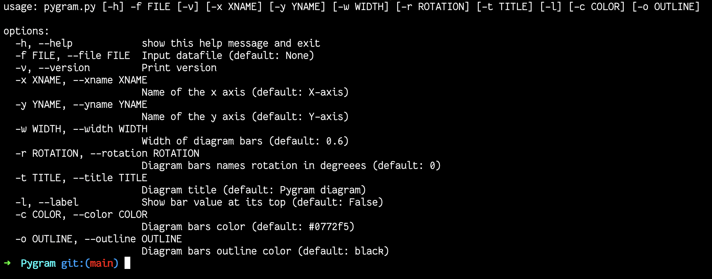

# pygram
Simple terminal python script for drawing bar diagrams
## Getting started
Clone the repository with 
```
$ git clone https://github.com/Dolfost/Pygram
```
Install dependencies
```
$ pip install -U matplotlib
```
Run
```
$ python3 pygram.py --help
```
to read help.
## Examples
Prompt
```
$ python3 pygram.py --file data1.txt --yname "Population" --xname "Country" --color "#0772f5" --title "Top 10 largest Europe countries" --rotation -90 --width 0.5 --label
```

produces


### Help

