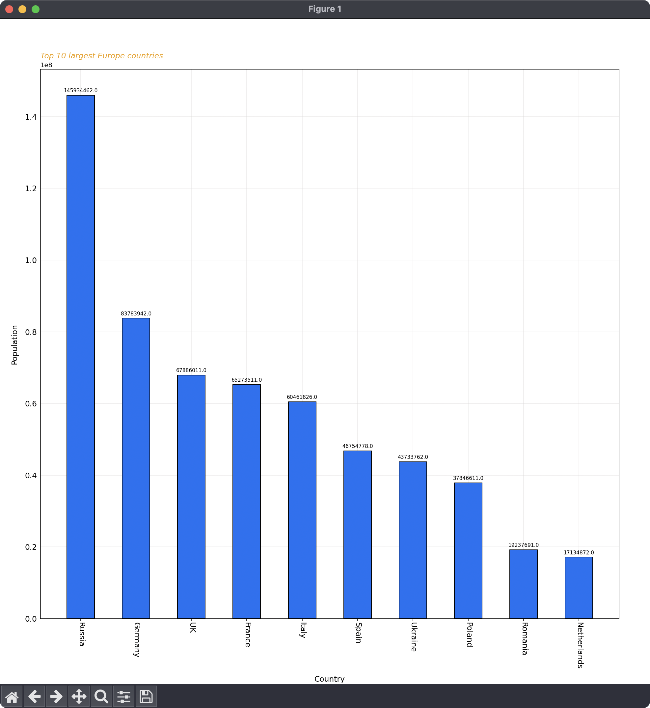

# pygram
Simple terminal python script for drawing bar diagrams
## Getting started
Clone the repository with 
```
$ git clone https://github.com/Dolfost/Pygram
```
Install dependicies
```
pip install -U matplotlib
```
Run
```
python3 pygram.py --help
```
to read help.
## Examples
Prompt


produces


### Help

```
python3 pygram.py -h
```

